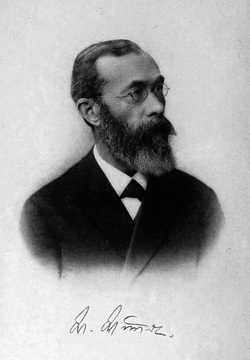

# Banderson98908.github.io
<!DOCTYPE html>
<html lang= en US>
<head>
  <title> Psychology </title>
  <meta name="viewport" content="width=device-width, initial-scale=1.0">

</head>
<body>
  <header>
  <h1> Psychology </h1>
  </header>
  
 
    <ul>
      <li><a href="file:///C:/Users/Craft/OneDrive/OneDrive%20-%20Zillah%20School%20District/sus%20website.html" target="_parent"><h3>Home</h3></a></li>
    </ul>
  

  

  

<h2> The Study of the Mind </h2>

  What is psychology? Everyone has heard the term, but if not, you are in the right
  place. Today’s subject is psychology, or more specifically the study of the human
  mind and its functions. Psych derives from Greek, it means mind, spirit, or
  consciousness, and the suffix –ology means the study of. It is a new science, since
  it was only identified in the late nineteenth century by a man named Wilhelm Wundt.
  However, many ancient civilizations practiced psychological studies such as the
  Greeks, Plato and Heraclitus, Egypt, ETC. This article will take you down the path
  of psychology, its early beginnings, its developed science, and how people use it today.

<h2> Greeks </h2>

  Going back to Greek Mythology, Psyche was a mortal woman with such immense beauty that
  the gods were jealous of her. The story of Psyche and her god husband is seen as early
  as 4th century BC, however there is only one surviving written narrative of their story
  called The Golden Ass. Written by Lucius Apuleius in 2nd Century AD tells of a story of
  a gorgeous mortal woman, whose beauty was so great she made the gods jealous. So jealous
  in fact that one, Aphrodite, sent her own son, Eros (Latin name Cupid), to have her marry
  the ugliest man he could find. Eros with one single shot from his bow and arrow could make
  anyone fall desperately in love. Only Eros was pricked by his own arrow, falling in love
  with Psyche (Greenberg, 2020). After completing many quests, Psyche was given a cup of
  Ambrosia, and the status of a god. Now a lawful marriage Eros and Psyche could be together
  lawfully, and not under threat of Aphrodite. Psyche is often regarded now as the Goddess of
  the Soul, showing where the prefix psych comes from and its meaning. People also take this
  story to heart, creating new ones like Beauty and the Beast. Where a beautiful girl is
  forced to be with a hideous monster, but it turns out they are a handsome man.

<h2> Dualism </h2>

  So, although psychology can’t be separated until the 1800s, you can see where the concepts of
  the human mind and thought processes appeared from. However, in the 17th century it is note
  worth that a French philosopher by the name of Rene Descartes introduced the idea of Dualism.
  Dualism is the idea that there are two sides, or forces, to everything. For example, many who
  practice Christianity believe there is both a God and Devil, so two opposite forces, and are
  therefore considered dualists. This concept can be similarly applied to the mind and body Rene
  Descartes discovered. According to an entry on Staford.edu in the summer of 2016, “Next I examined
  attentively what I was. I saw that while I could pretend that I had no body and that there was no
  world and no place for me to be in, I could not for all that pretend that I did not exist. I saw
  on the contrary that from the mere fact that I thought of doubting the truth of other things, it
  followed quite evidently and certainly that I existed; whereas if I had merely ceased thinking,
  even if everything else I had ever imagined had been true, I should have had no reason to believe
  that I existed. From this I knew I was a substance whose whole essence or nature is simply to
  think, and which does not require any place, or depend on any material thing, in order to exist.
  (6:32–3)” Rene is describing in this passage that he can disassociate his mind from his human body
  but can’t get himself to believe he doesn’t exist. Due to this conclusion, he believes the purpose
  of humans is to think, and therefore a completely different study than philosophy. So, the mind and
  body work together to form the human experience.

<h2> The First Psychologist </h2>

  This leads to William Wundt, the first person to be referred to as a psychologist. Wundt lived from
  about 1832-1920 and authored the book, the Principles of Physiological Psychology. Wundt began looking
  at psychology as specifically the study of consciousness. Wundt used introspection, where people studied
  the mind as objectively as possible to be able to apply quantitative data to the mind. He used this
  strategy under very fixed conditions to create a repeatable experience so that a person can accurately
  show their reaction to stimuli. The first requirement was trained observers who know what to look for
  during an experiment. The second requirement was to use a sustainable stimulus that allowed the subject
  to expect what was coming and therefore be more aware of their reaction. This method to understand the
  mind is called structuralism. Wundt would establish a laboratory in a university at Leipzig in 1879.
  In this laboratory he would conduct experiments on subjects, testing reaction times. A patient woul d
  be in a room separated from the scientists checking them, where they would be exposed to light, sound,
  or an image. They would then press a button after being exposed, and an apparatus would record the
  amount of time it took for them to react (OSCRiceUniversity).

<h2> Functionalism </h2>

  The next leading scientist at the time, William James, devised a different idea on psychology. James
  believed that Functionalism is a better way to study psychology of the human mind. What Functionalism
  proposes the key idea of natural selection leading organisms to be adapted to their environment including
  to their behavior. From James perspective, psychology is the way to study this behavior in the world and
  scientifically explain it. The second meaning to functionalism is: functionalists tend to look at the
  mind as a whole, opposed to structuralisms view of looking at the mind as sections. James thought
  similarly to Wundt, in that introspection would be one way to study the mind. But also used objective
  measures with many different recording devices and many other concrete products to study anatomy and
  physiology. James is the first American Psychologist.

<h2> Psychoanalysis </h2>

  A more well-known and decelerated psychologist goes by the name of Sigmund Freud, whose studies dominated
  the early psychology industry and teachings. Freud was an Austrian psychologist interested in his patients
  suffering from hysteria and neurosis. Hysteria at the time was a word associated with patients suffering
  from a wide range of symptoms, including physical symptoms and emotional disturbances. According to
  opentext.wsu.edu Freud theorized that these issues arose from the unconscious mind. Therefore, from Freuds
  point of view, gaining access to the mind was imperative to solving these issues. The path taken by Freud
  was dream analysis, by analyzing the first word to come to a person's mind or the slightest slip of the
  tongue. Psychoanalytic Theory focuses on the role of a person’s unconscious mind, and this theme of study
  dominated the medical field for many decades. Freud would author a book, going more into depth about his
  studies of psychoanalytic theory in 1922 titled, “A General Introduction to Psychoanalysis.”

  
  <h6><i>Cupid awakes Pysche with a kiss </i></h6>

  
  <h6><i> William Wundt </i></h6>

  
  <h6><i> Psychoanalysis </i></h6>

 

  <h5> if you see this it means that your current browser does not support this article yet </h5>

<footer>
  

  <h5>Work cited</h5>
  <h5>About the writer</h5>
  <h5>More articles about Psychology</h5>
  <h5>Contact me</h5>
  

</footer>

<!--
EXAMPLES
https://css-tricks.com/snippets/css/complete-guide-grid/

https://dreamfusion3d.github.io/
 -->
</body>
</html>
